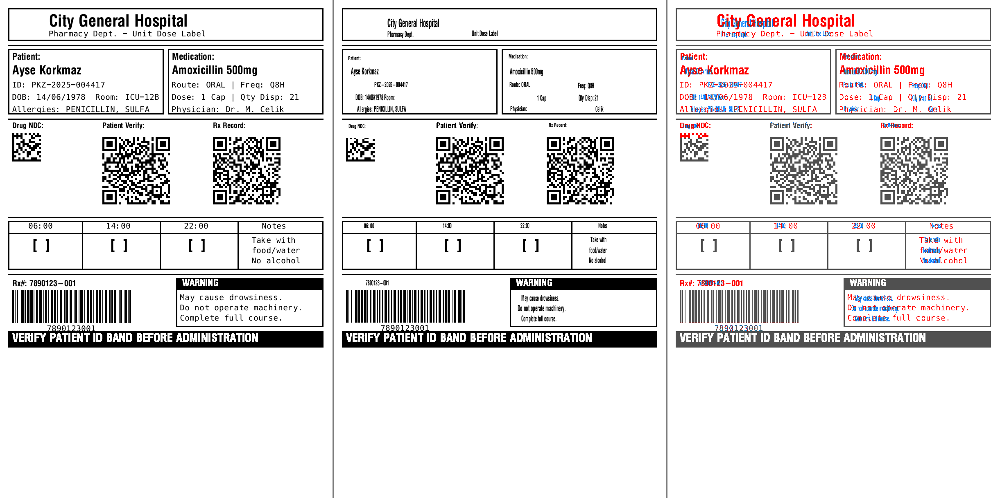

# ZPL Visual Editor

A full-featured 2D label design editor built with Python and PyQt6 for visually editing ZPL (Zebra Programming Language) code. Features a split-panel interface with a ZPL code editor on the left and a WYSIWYG visual canvas on the right, with real-time bidirectional synchronization.



## Features

### Visual Editor
- **WYSIWYG Canvas** -- drag-and-drop label elements on a QGraphicsScene/QGraphicsView canvas
- **Code Editor** -- syntax-highlighted ZPL editor with live preview
- **Bidirectional Sync** -- every visual change updates ZPL code instantly; every code change updates the canvas (500ms debounce)
- **Zoom & Pan** -- scroll wheel zoom, middle-click pan, ruler guides
- **Grid & Snap** -- configurable snap-to-grid for precise element placement
- **Undo/Redo** -- full QUndoStack-based history

### Label Elements
| Element | ZPL Commands | Description |
|---------|-------------|-------------|
| Text | `^FO` `^A0N` `^FD` | Scalable text with font 0, vertical/horizontal stretching |
| Box | `^GB` | Rectangle outlines with configurable border thickness |
| Line | `^GB` | Horizontal and vertical lines (width/height <= thickness) |
| Circle | `^GC` | Circle/ellipse elements |
| Diagonal Line | `^GD` | Diagonal lines between corners |
| Barcode | `^BC` `^B3` `^BY` | Code 128, Code 39, EAN-13 with HRI text |
| QR Code | `^BQ` | QR codes with configurable magnification and ECC |
| Image | `^GFA` | Bitmap graphics (Graphic Field ASCII) |
| Reverse Text | `^FR` | White text on black background |

### Image-to-ZPL Conversion
Import a label image (PNG) and automatically convert it to structured ZPL code:

- **Barcode Detection** -- pyzbar + heuristic scanline analysis for Code 128 / Code 39 / EAN-13
- **QR Code Detection** -- pyzbar + OpenCV QR detector
- **Text Recognition** -- RapidOCR + EasyOCR (pure Python, primary) + Tesseract OCR (optional fallback)
- **Line & Box Detection** -- contour analysis with thickness measurement
- **Reverse Text Detection** -- detects white-on-black banners and per-region text color
- **Smart Barcode Rendering** -- uses structured `^BC` when module width matches integer grid, falls back to `^GFA` bitmap when fractional module width causes progressive bar misalignment
- **QR Bitmap Preservation** -- encodes QR codes as `^GFA` to preserve exact module patterns from the original image

**Pixel Accuracy:** Achieves **>=96%** pixel similarity across test labels using structured ZPL elements (text remains as `^FD`/`^A0N`, not converted to bitmaps).

### Local Rendering
- **No API dependency** -- renders ZPL labels locally using Qt (no Labelary API required)
- **Headless renderer** -- `zpl_renderer.py` converts ZPL to PNG without opening a window
- **Accurate font mapping** -- Zebra font 0 mapped to Consolas/Courier with DemiBold weight, NoAntialias strategy

### Editing Tools
- **Selection** -- click, Ctrl+click (multi), rubber band, Ctrl+A
- **Resize Handles** -- 8-point resize (4 corners + 4 edge midpoints)
- **Property Panel** -- edit element properties (position, size, data, font)
- **Alignment** -- Left, Right, Top, Bottom, Center H, Center V
- **Toolbar** -- quick-add Text, Line, Rectangle, Circle, Barcode, QR Code
- **Right-click Menu** -- copy, paste, delete, bring to front/back
- **Export** -- save as PNG

## Project Structure

```
zpl_editor/
├── main.py, app.py                  # Entry points
├── core/
│   ├── zpl_parser.py                # ZPL code -> LabelModel (regex-based parser)
│   ├── zpl_generator.py             # LabelModel -> ZPL code
│   ├── zpl_commands.py              # ZPLElement, LabelSettings dataclasses
│   ├── zpl_renderer.py              # Local headless ZPL -> PNG renderer
│   ├── label_model.py               # Label data model (settings + elements)
│   └── coordinate_system.py         # DPI/dot/mm/inch conversions
├── elements/
│   ├── base_element.py              # Abstract base (QGraphicsItem)
│   ├── text_element.py              # Text (^FO + ^A + ^FD)
│   ├── barcode_element.py           # Barcode (^BC, ^B3, ^BY) with Code 128 encoder
│   ├── qr_element.py                # QR code (^BQ) with qrcode library
│   ├── box_element.py               # Box/rectangle (^GB)
│   ├── line_element.py              # Line (^GB)
│   ├── circle_element.py            # Circle (^GC)
│   ├── diagonal_line.py             # Diagonal line (^GD)
│   ├── image_element.py             # Bitmap graphic (^GFA)
│   └── field_element.py             # Compound field element
├── ui/
│   ├── main_window.py               # QMainWindow with splitter, menus, toolbar
│   ├── code_editor.py               # Left panel -- ZPL editor (syntax highlighting)
│   ├── canvas_view.py               # Right panel -- QGraphicsView (zoom/pan/grid)
│   ├── canvas_scene.py              # QGraphicsScene -- element management
│   ├── property_panel.py            # Selected element properties
│   ├── toolbar.py                   # Top toolbar
│   ├── statusbar.py                 # Bottom status bar
│   └── image_analysis_view.py       # OCR region detection preview
├── image_processing/
│   ├── image_analyzer.py            # Image analysis -- barcode/QR/text/line detection
│   └── zpl_from_image.py            # Detected regions -> ZPL code
├── graphics/
│   ├── selection_handles.py         # 8-point resize handle system
│   ├── grid_overlay.py              # Snap-to-grid overlay
│   ├── ruler.py                     # Ruler (top/left)
│   └── zoom_controller.py           # Zoom management
├── fonts/
│   ├── zebra_fonts.py               # Zebra font definitions (0-9, A-Z)
│   └── font_mapper.py               # ZPL font ID -> QFont mapping
└── utils/
    ├── undo_redo.py                 # QUndoStack-based undo/redo
    ├── clipboard.py                 # Copy/paste
    ├── export.py                    # PNG export
    └── settings.py                  # App settings
```

## Requirements

- Python 3.10+
- **Optional:** [Tesseract OCR](https://github.com/UB-Mannheim/tesseract/wiki) installed at `C:\Program Files\Tesseract-OCR\` 


### Python Dependencies

```
PyQt6
numpy
opencv-python
pytesseract          # optional: only used if Tesseract exe is installed
rapidocr_onnxruntime # primary OCR engine (pure pip, ~15MB ONNX models)
easyocr              # secondary OCR engine (pure pip, PyTorch-based)
pyzbar
qrcode
python-barcode
requests
```

## Installation

```bash
# Clone the repository
git clone https://github.com/katifurkan/Zpl.git
cd Zpl

# Create virtual environment
python -m venv .venv

# Activate (Windows)
.venv\Scripts\activate

# Install dependencies
pip install -r requirements.txt
pip install opencv-python
```

## Usage

```bash
python main.py
```

### Workflow

1. **Create from scratch** -- use the toolbar to add text, barcodes, QR codes, boxes, lines
2. **Edit ZPL code** -- type ZPL in the left panel, see it rendered on the right
3. **Import image** -- click "Import" to load a label PNG, then "Analyze Image" + "Generate ZPL from Image" to convert it to editable ZPL
4. **Export** -- save the rendered label as PNG

### ZPL Commands Supported

| Priority | Commands |
|----------|----------|
| Core | `^XA` `^XZ` `^FO` `^FT` `^FD` `^FS` `^A` `^CF` `^CI` `^GB` |
| Barcode | `^BC` (Code128) `^B3` (Code39) `^BE` (EAN13) `^BY` `^BQ` (QR) |
| Graphics | `^GC` (circle) `^GD` (diagonal) `^GFA` (bitmap) |
| Layout | `^FB` (field block) `^FW` (orientation) `^PW` `^LL` `^LH` `^FR` |
| Comment | `^FX` |

## Coordinate System

- Origin: top-left corner (0, 0)
- X increases to the right, Y increases downward
- All coordinates in dots (1 dot = 1 pixel at native DPI)
- Default: 203 DPI (1 mm = 8 dots, 1 inch = 203 dots)
- Standard 4" x 6" label = 812 x 1218 dots

## Examples

The `Examples/` directory contains sample labels:

```
Examples/
├── input/          # Source label PNG images
├── output/
│   ├── ZPLCode/    # Generated ZPL code
│   └── ZplImage/   # Rendered output images
└── diff/           # Side-by-side comparison images
```

## Architecture Notes

- **Bidirectional sync** uses a `_syncing` flag to prevent infinite update loops between code editor and canvas
- **ZPL Parser** is a state machine: `^FO` starts an element, `^FS` ends it, commands in between add properties
- **Text rendering** uses vertical scaling (capHeight-based) to match ZPL font 0 behavior where ink fills ~75% of the specified font height
- **Code 128 encoder** supports explicit subset forcing via `>:` (Code B) and `>7` (Code C) prefixes to match the original barcode encoding

## License

This project is provided as-is for educational and development purposes.
